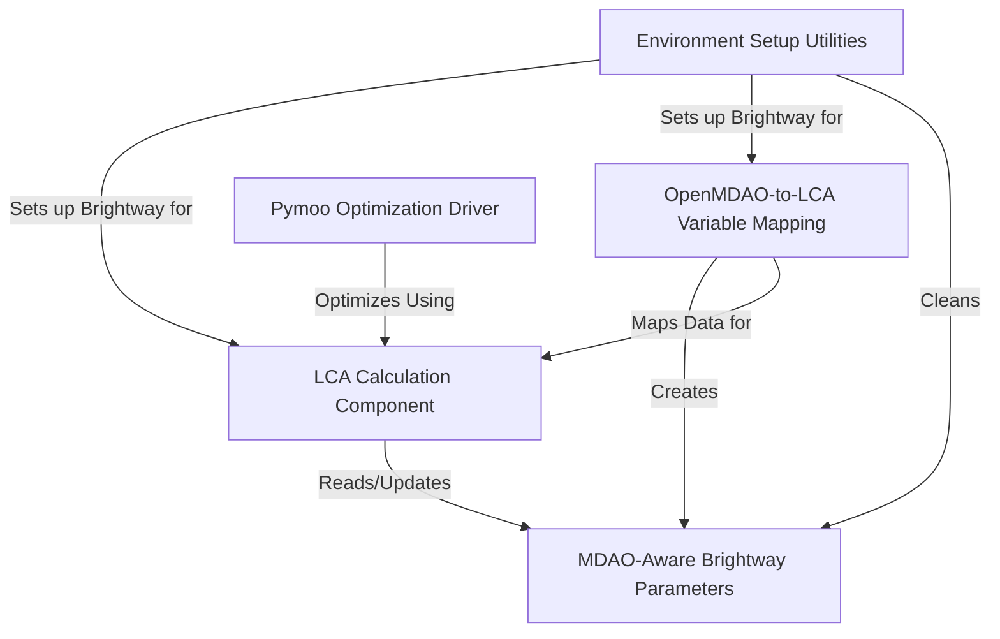

# Tutorial: LCA4MDAO

`LCA4MDAO` is a project that helps engineers design better products by considering their *environmental impact* alongside traditional engineering goals. It connects the **OpenMDAO** framework, used for complex system optimization, with the **Brightway2** software, used for calculating a product's environmental footprint (like carbon emissions). This allows you to optimize your design to be **lighter**, **cheaper**, *and* more *environmentally friendly* at the same time.

## Visual Overview

## Chapters

1. [Environment Setup Utilities
](01_environment_setup_utilities_.md)
2. [OpenMDAO-to-LCA Variable Mapping
](02_openmdao_to_lca_variable_mapping_.md)
3. [MDAO-Aware Brightway Parameters
](03_mdao_aware_brightway_parameters_.md)
4. [LCA Calculation Component
](04_lca_calculation_component_.md)
5. [Pymoo Optimization Driver
](05_pymoo_optimization_driver_.md)

---

Generated by [AI Codebase Knowledge Builder](https://github.com/The-Pocket/Tutorial-Codebase-Knowledge).
