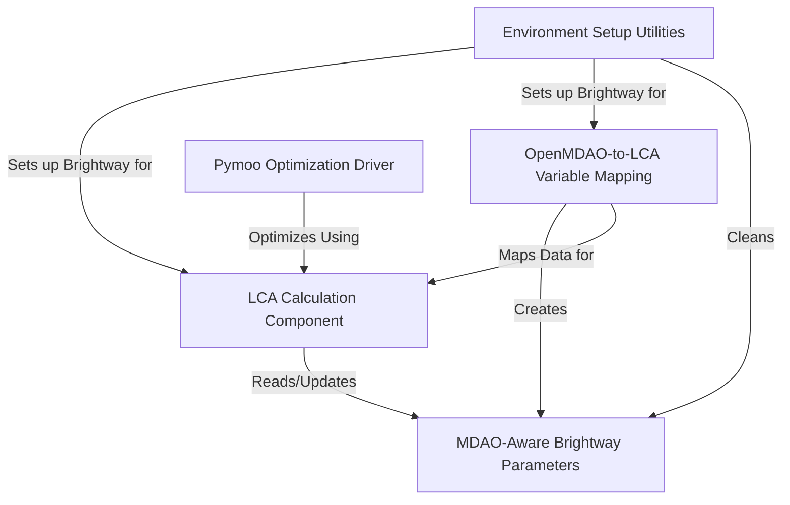
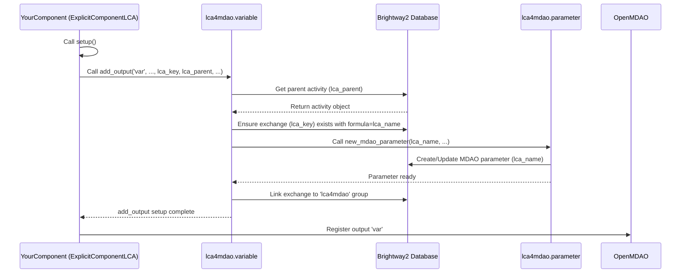
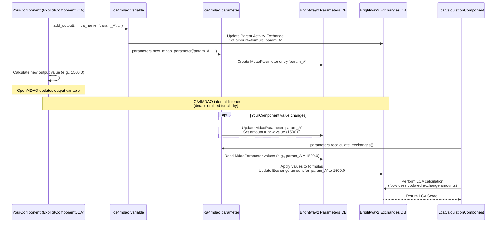
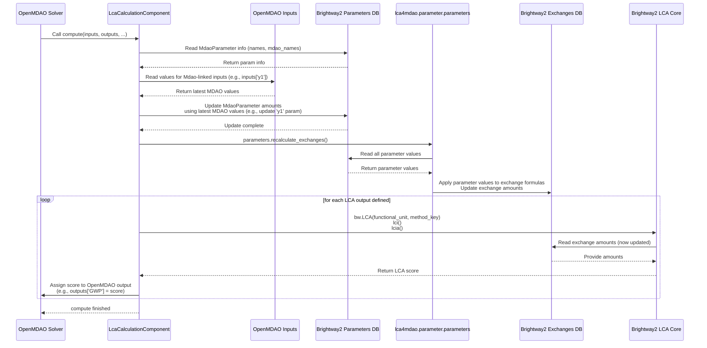
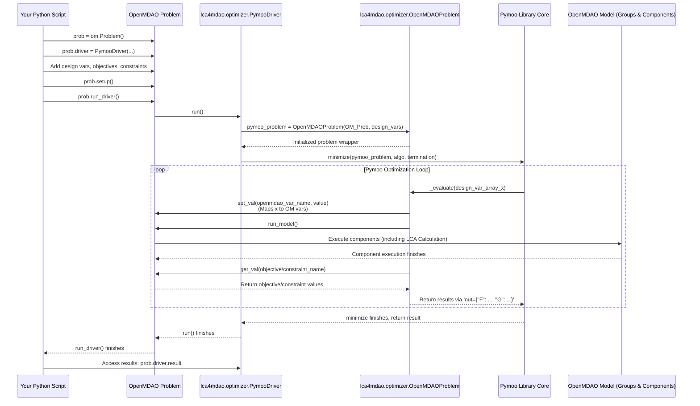

# Tutorial: LCA4MDAO

`LCA4MDAO` is a project that helps engineers design better products by considering their *environmental impact* alongside traditional engineering goals. It connects the **OpenMDAO** framework, used for complex system optimization, with the **Brightway2** software, used for calculating a product's environmental footprint (like carbon emissions). This allows you to optimize your design to be **lighter**, **cheaper**, *and* more *environmentally friendly* at the same time.


## Visual Overview



## Chapters

1. [Environment Setup Utilities
](01_environment_setup_utilities_.md)
2. [OpenMDAO-to-LCA Variable Mapping
](02_openmdao_to_lca_variable_mapping_.md)
3. [MDAO-Aware Brightway Parameters
](03_mdao_aware_brightway_parameters_.md)
4. [LCA Calculation Component
](04_lca_calculation_component_.md)
5. [Pymoo Optimization Driver
](05_pymoo_optimization_driver_.md)

---

# Chapter 2: OpenMDAO-to-LCA Variable Mapping

Welcome back to the `LCA4MDAO` tutorial! In the [previous chapter](01_environment_setup_utilities_.md), we set up our essential environment by initializing Brightway2 and importing LCA databases. Now that our LCA environment is ready, the crucial next step is to connect the design and performance variables calculated *within* your OpenMDAO model to the inputs required for the Life Cycle Assessment.

Think about it: your OpenMDAO model determines things like the weight of a component, the amount of fuel consumed, or the electrical energy used. To perform an LCA, you need to know *these specific amounts* for the design currently being evaluated. How does `LCA4MDAO` bridge this gap, taking a number from an OpenMDAO calculation and feeding it into a Brightway2 LCA activity?

This is where **OpenMDAO-to-LCA Variable Mapping** comes in. It's the mechanism that automatically takes the value of an OpenMDAO output variable and makes it available as a parameter for your LCA calculations in Brightway2.

## The Problem: Bridging OpenMDAO and Brightway2

Imagine you have an OpenMDAO component that calculates the structural weight of an aircraft wing made primarily of aluminum. It outputs a variable, let's call it `wing_weight`, with a value in kilograms.

```python
from openmdao.api import ExplicitComponent

class WingWeightComp(ExplicitComponent):
    def setup(self):
        # ... inputs for wing design parameters ...
        self.add_output('wing_weight', units='kg', val=1000.0)
        # ... declare partials ...

    def compute(self, inputs, outputs):
        # ... calculation of outputs['wing_weight'] ...
        pass
```

Meanwhile, in your Brightway2 LCA database, you have an activity representing "aluminum production" that takes 'kilogram' as an input amount to model its environmental impact.

The challenge is: how do you dynamically tell Brightway2 to use the current `wing_weight` value from your OpenMDAO model as the amount of 'aluminum production' input for your LCA calculation?

Manually updating Brightway2 every time OpenMDAO changes a variable during an optimization run would be impossible. We need an automated, integrated system.

## The Solution: `ExplicitComponentLCA`

`LCA4MDAO` solves this with a specialized OpenMDAO component type: `ExplicitComponentLCA`. This component is a standard OpenMDAO `ExplicitComponent` but with added capabilities to automatically handle the LCA mapping.

The key difference is in how you define outputs. When you declare an output variable using `self.add_output` in an `ExplicitComponentLCA`, you can include extra arguments (`lca_key`, `lca_parent`, etc.) that provide the mapping information to Brightway2.

Let's see how our `WingWeightComp` example would look using `ExplicitComponentLCA`:

```python
from lca4mdao.variable import ExplicitComponentLCA
import brightway2 as bw # Needed to get the LCA activity key

# Define the key for the aluminum activity in your database
# This assumes 'ecoinvent 3.8 cutoff' is your database name
# and you know the specific key for aluminum production
# You'd get this key by searching your Brightway2 database
aluminum_production_key = ('ecoinvent 3.8 cutoff', 'some_aluminum_activity_code')

# Define the key for the parent activity that will 'consume' the aluminum
# Let's assume you created a custom activity for your aircraft assembly
aircraft_assembly_key = ('aircraft', 'hybrid_aircraft') # From example code

class WingWeightCompLCA(ExplicitComponentLCA):
    def setup(self):
        # ... inputs for wing design parameters ...

        # Now, declare the output with LCA mapping information
        self.add_output(
            'wing_weight',
            units='kg',
            val=1000.0,
            lca_key=aluminum_production_key, # What LCA activity does this variable map to?
            lca_parent=aircraft_assembly_key, # Which LCA activity uses this input?
            lca_units='kilogram',           # What unit should Brightway2 use?
            lca_name='wing_aluminum_input', # A name for this specific LCA input (can be same as output name)
            exchange_type='technosphere'    # Is it a production input ('technosphere') or emission ('biosphere')?
        )
        # ... declare partials ...

    def compute(self, inputs, outputs):
        # ... calculation of outputs['wing_weight'] ...
        # For the example, let's just set a dummy value
        outputs['wing_weight'] = 1500.0 # Example calculated weight
```

**Explanation:**

1.  **`from lca4mdao.variable import ExplicitComponentLCA`**: We import the specialized component class.
2.  **Inherit from `ExplicitComponentLCA`**: Your component class now inherits from `ExplicitComponentLCA` instead of the standard `ExplicitComponent`.
3.  **`lca_key`**: This tells `LCA4MDAO` *which* specific activity from your LCA database (like Ecoinvent) corresponds to this output variable. You provide the Brightway2 key (usually a tuple like `('database_name', 'activity_code')`).
4.  **`lca_parent`**: This is the key of the Brightway2 activity that *uses* or *consumes* the material/energy represented by this variable. In our example, the 'aircraft assembly' activity uses the 'aluminum production' activity.
5.  **`lca_units`**: The units required by the LCA activity in Brightway2. `LCA4MDAO` handles unit conversion if your OpenMDAO `units` are different, but specifying the correct LCA unit here is crucial.
6.  **`lca_name`**: A unique name for this specific input *within* the `lca_parent` activity in Brightway2. This name is used to create a special Brightway2 parameter.
7.  **`exchange_type`**: Specifies if this is a standard input/output in the economic/industrial system (`'technosphere'`) or an emission/resource flow to/from the environment (`'biosphere'`). Aluminum production is a technosphere activity input. If you were mapping CO2 emissions, it would be `'biosphere'`.

When OpenMDAO's `prob.setup()` is called, the `ExplicitComponentLCA` component registers its LCA-mapped outputs. `LCA4MDAO` intercepts this and does some magic (explained below) to set up the connection in Brightway2. Then, during `prob.run_driver()` or `prob.run_model()`, whenever the `compute` method of this component is executed and updates the `wing_weight` output, `LCA4MDAO` automatically pushes this new value into the corresponding Brightway2 parameter.

## How it Works (The Magic Behind `add_output`)

Let's look at the `add_output` method within `ExplicitComponentLCA` (in `lca4mdao/variable.py`) and trace what happens when those `lca_` arguments are provided.

```python
# Simplified view of lca4mdao/variable.py
class ExplicitComponentLCA(ExplicitComponent):
    # ... other methods ...

    def add_output(self, name, val=1.0, ..., lca_key=None, lca_name=None,
                   lca_units=None, lca_parent=("mdao", "functional_unit"),
                   exchange_type="technosphere", ...):

        if lca_key is not None: # <-- This block is the LCA mapping part
            # 1. Basic checks (e.g., ensure val is scalar)
            if not np.isscalar(val):
                 # ... raise error ...

            # 2. Set default names/units if not provided
            if lca_name is None:
                lca_name = name
            if lca_units is None:
                # ... logic to guess units ...
                lca_units = 'unit' if units is None else units

            # 3. Add/Update the exchange in the parent LCA activity
            activity = bw.get_activity(lca_parent)
            # Remove any existing exchange to the same lca_key
            for exc in activity.exchanges():
                 if exc.input == lca_key:
                     exc.delete()
            # Add the new exchange, using the lca_name as the formula
            activity.new_exchange(input=lca_key, amount=val, formula=lca_name, type=exchange_type).save()

            # 4. Create/Update a special MDAO parameter in Brightway2
            from .parameter import parameters # Access the parameter manager
            parameters.new_mdao_parameter(lca_name, val, name, lca_units)

            # 5. Link the exchange to the lca4mdao parameter group
            parameters.add_exchanges_to_group("lca4mdao", activity)

        # Call the original OpenMDAO add_output to register the variable
        return super().add_output(name, val=val, ...)
```

**Step-by-step Walkthrough (During `prob.setup()`):**

1.  When `prob.setup()` is called, OpenMDAO processes each component and its `setup` method.
2.  When your `ExplicitComponentLCA` component's `setup` runs, it calls `self.add_output(...)` for each output.
3.  For outputs with `lca_key` provided, the `if lca_key is not None:` block inside `ExplicitComponentLCA.add_output` is executed.
4.  It retrieves the target "parent" LCA activity (`lca_parent`) from Brightway2.
5.  It ensures that an *exchange* exists within this parent activity linking it to the `lca_key` activity (e.g., the 'aircraft assembly' activity having an input exchange from 'aluminum production'). Crucially, it sets the *amount* of this exchange to a *formula* which is just the `lca_name` you provided (e.g., `formula='wing_aluminum_input'`). This means the amount is now controlled by a parameter named 'wing\_aluminum\_input'.
6.  It then calls `parameters.new_mdao_parameter(lca_name, val, name, lca_units)`. This utility function, part of `lca4mdao`'s parameter management (which we'll cover in [Chapter 3: MDAO-Aware Brightway Parameters](03_mdao_aware_brightway_parameters_.md)), creates or updates a special parameter named `lca_name` (e.g., 'wing\_aluminum\_input') in Brightway2, stores its initial value (`val`), and links it back to the OpenMDAO output variable's name (`name`) and units.
7.  Finally, it associates this exchange with the `lca4mdao` parameter group in Brightway2, marking it as parameterized by `lca4mdao`.
8.  The original `OpenMDAO.ExplicitComponent.add_output` is called to complete the standard OpenMDAO variable registration.

**What happens during `prob.run_driver()`:**

*   As the OpenMDAO solver runs, it updates the output values of your components.
*   Whenever the `compute` method of your `ExplicitComponentLCA` runs and changes an LCA-mapped output (like `wing_weight`), `LCA4MDAO` has a listener or mechanism that detects this change.
*   This mechanism automatically pushes the *new* value of the OpenMDAO output (`wing_weight`) into the corresponding Brightway2 MDAO parameter ('wing\_aluminum\_input').
*   (As you'll see in [Chapter 4: LCA Calculation Component](04_lca_calculation_component_.md)), the `LcaCalculationComponent` triggers a recalculation of Brightway2 parameters *before* performing the LCA calculation, ensuring the latest MDAO values are used.

Here's a simple sequence diagram for the `setup` part of the mapping:



This mapping means that your OpenMDAO components can calculate whatever they need to, and as long as you declare the outputs using `ExplicitComponentLCA` with the correct `lca_` arguments, `LCA4MDAO` takes care of synchronizing those values with the necessary inputs in your Brightway2 LCA model.

## Example from the Code

Let's look at a simplified example from the provided `hybrid_aircraft.py` code, specifically the `Environment` component. This component gathers outputs from various parts of the aircraft model (like battery weight, structure weight, fuel used) and maps them to corresponding LCA inputs.

```python
# Simplified Environment component from hybrid_aircraft.py
from lca4mdao.variable import ExplicitComponentLCA
import brightway2 as bw # Needed for the LCA keys

# Assume these keys are defined earlier and correspond to specific
# activities in your Brightway2 database (e.g., Ecoinvent)
battery_key = ('ecoinvent 3.8 cutoff', 'battery_activity_code')
aluminium_key = ('ecoinvent 3.8 cutoff', 'aluminum_activity_code')
kerosene_key = ('ecoinvent 3.8 cutoff', 'kerosene_activity_code')
CO2_key = ('biosphere3', 'CO2_flow_code') # CO2 is a biosphere flow

# Assume these custom activities are built in Brightway2 (see build_data() in example)
aircraft_assembly_key = ("aircraft", "hybrid_aircraft")
aircraft_flight_key = ("aircraft", "hybrid_flight")


class Environment(ExplicitComponentLCA):
    def setup(self):
        # Inputs come from other OpenMDAO components
        self.add_input('battery_weight', units='kg')
        self.add_input('structure_weight', units='kg')
        self.add_input('kerosene', units='kg') # This is *per flight* fuel burn

        # Map component inputs/calculated values to LCA outputs
        self.add_output(
            'battery',         # OpenMDAO output name (can be anything)
            units='kg',        # OpenMDAO units
            val=0.,
            lca_parent=aircraft_assembly_key, # Parent activity (assembly)
            lca_units='kilogram',             # LCA unit required
            lca_key=battery_key,              # Battery production activity
            lca_name='battery_production_input' # Name of the parameter/exchange in LCA
        )
        self.add_output(
            'aluminium',
            units='kg',
            val=0.,
            lca_parent=aircraft_assembly_key, # Parent activity (assembly)
            lca_units='kilogram',
            lca_key=aluminium_key,            # Aluminium production activity
            lca_name='structure_aluminium_input'
        )
        self.add_output(
            'amount_kerosene', # OpenMDAO output name
            units='kg',
            val=0.,
            lca_parent=aircraft_flight_key,  # Parent activity (flight)
            lca_units='kilogram',
            lca_key=kerosene_key,            # Kerosene production activity
            lca_name="kerosene_consumption_input" # Name of the parameter/exchange
        )
        self.add_output(
            'CO2',
            units='kg',
            val=0.,
            lca_parent=aircraft_flight_key,  # Parent activity (flight)
            lca_units='kilogram', # Units for CO2 flow
            lca_key=CO2_key,                 # CO2 emission flow (biosphere)
            lca_name="CO2_emission",
            exchange_type='biosphere'        # Indicate it's a biosphere flow
        )

        self.declare_partials('*', '*', method='fd')

    def compute(self, inputs, outputs):
        # This is where the OpenMDAO calculation happens.
        # The values of the inputs (calculated by other components)
        # are assigned to the outputs that are mapped to LCA.

        outputs['battery'] = inputs['battery_weight']
        outputs['aluminium'] = inputs['structure_weight']
        # Note: the example multiplies kerosene by cycles here for total impact
        outputs['amount_kerosene'] = inputs['kerosene'] # Assuming inputs['kerosene'] is total for all cycles
        # Note: the example calculates CO2 based on kerosene here
        outputs['CO2'] = inputs['kerosene'] * 3.15 # Simplified: 3.15 kg CO2 per kg kerosene
```

**Mapping Details Table:**

| OpenMDAO Variable Name (`name`) | OpenMDAO Units (`units`) | LCA Parameter Name (`lca_name`) | LCA Unit (`lca_units`) | LCA Source (`lca_key`)           | LCA Parent (`lca_parent`) | Exchange Type (`exchange_type`) |
| :------------------------------ | :----------------------- | :------------------------------ | :--------------------- | :------------------------------- | :------------------------ | :------------------------------ |
| `battery`                       | `kg`                     | `battery_production_input`      | `kilogram`             | `battery_key` (ecoinvent)        | `aircraft_assembly_key`   | `technosphere`                  |
| `aluminium`                     | `kg`                     | `structure_aluminium_input`     | `kilogram`             | `aluminium_key` (ecoinvent)      | `aircraft_assembly_key`   | `technosphere`                  |
| `amount_kerosene`               | `kg`                     | `kerosene_consumption_input`    | `kilogram`             | `kerosene_key` (ecoinvent)       | `aircraft_flight_key`     | `technosphere`                  |
| `CO2`                           | `kg`                     | `CO2_emission`                  | `kilogram`             | `CO2_key` (biosphere3)           | `aircraft_flight_key`     | `biosphere`                     |

This component serves as a central point where various MDAO outputs are collected and explicitly linked to their corresponding inputs or emissions in the LCA model. By using `ExplicitComponentLCA` and these specific `add_output` parameters, `LCA4MDAO` knows which OpenMDAO variable corresponds to which Brightway2 parameter and exchange, automating the data transfer.

## Conclusion

In this chapter, we explored the core concept of OpenMDAO-to-LCA Variable Mapping in `LCA4MDAO`. We learned that the specialized `ExplicitComponentLCA` allows you to tag OpenMDAO output variables with specific LCA information (`lca_key`, `lca_parent`, `lca_units`, `lca_name`, `exchange_type`). This mapping automatically creates and manages parameters in Brightway2 that are linked to your OpenMDAO variables, ensuring that the latest design values are available for LCA calculations.

This mechanism provides the crucial link, automatically keeping your LCA model synchronized with the changing design during an OpenMDAO run.

Now that we understand how MDAO variables are mapped and transferred to Brightway2 as parameters, the next step is to understand these special Brightway2 parameters themselves and how they integrate with the LCA calculation process. This is the topic of the next chapter: [MDAO-Aware Brightway Parameters](03_mdao_aware_brightway_parameters_.md).

---

<sub><sup>Generated by [AI Codebase Knowledge Builder](https://github.com/The-Pocket/Tutorial-Codebase-Knowledge).</sup></sub> <sub><sup>**References**: [[1]](https://github.com/mid2SUPAERO/LCA4MDAO/blob/229090922a6d94c358244f6d01104344218a71ee/lca4mdao/examples/hybrid_aircraft.py), [[2]](https://github.com/mid2SUPAERO/LCA4MDAO/blob/229090922a6d94c358244f6d01104344218a71ee/lca4mdao/examples/sellar.py), [[3]](https://github.com/mid2SUPAERO/LCA4MDAO/blob/229090922a6d94c358244f6d01104344218a71ee/lca4mdao/examples/sellar_ecoinvent.py), [[4]](https://github.com/mid2SUPAERO/LCA4MDAO/blob/229090922a6d94c358244f6d01104344218a71ee/lca4mdao/parameter.py), [[5]](https://github.com/mid2SUPAERO/LCA4MDAO/blob/229090922a6d94c358244f6d01104344218a71ee/lca4mdao/variable.py)</sup></sub>

# Chapter 3: MDAO-Aware Brightway Parameters

Welcome back to the `LCA4MDAO` tutorial! In the [previous chapter](02_openmdao_to_lca_variable_mapping_.md), we learned how to connect variables calculated by your OpenMDAO components to specific inputs or outputs needed for your Life Cycle Assessment (LCA). We saw how using the `ExplicitComponentLCA` and its special `lca_` arguments creates this link.

But what exactly happens *inside* Brightway2 when you make these connections? How does Brightway2 know *where* to get the value for, say, the amount of aluminum needed for your component, if that value is coming from OpenMDAO and not from a standard formula or a fixed number in the Brightway2 database itself?

This is where the concept of **MDAO-Aware Brightway Parameters** comes in. `LCA4MDAO` introduces a special kind of parameter within Brightway2 specifically designed to hold values that come from your Multidisciplinary Design Optimization (MDAO) model.

## The Problem: Dynamic Values from OpenMDAO

Brightway2 has a powerful parameter system. You can define activity parameters, database parameters, or project parameters. These are great for setting values that are fixed, based on simple formulas (`amount = param_A * 2`), or calculated from other Brightway2 parameters.

However, the values we're interested in for LCA-MDAO come directly from OpenMDAO. They are the outputs of complex engineering calculations (`wing_weight` from a structural component, `fuel_burn` from a propulsion component, etc.). These values change dynamically during an optimization run.

Brightway2's standard parameters aren't set up to be controlled by an external Python program like OpenMDAO. We need a dedicated placeholder in the Brightway2 parameter system that knows:

1.  "My value should come from OpenMDAO, not from an internal formula."
2.  "I represent this specific quantity (like 'amount of aluminum')."
3.  "My current value is X (as provided by OpenMDAO)."

## The Solution: The `MdaoParameter`

To solve this, `LCA4MDAO` adds a new type of parameter to Brightway2 called `MdaoParameter`. You can think of `MdaoParameter` as a special entry in Brightway2's parameter database whose sole purpose is to store a value that `LCA4MDAO` gets from OpenMDAO.

These `MdaoParameter` instances are created and managed automatically by `LCA4MDAO` when you define your variable mappings using the `lca_` arguments in `ExplicitComponentLCA`.

Let's revisit the mapping we saw in Chapter 2:

```python
from lca4mdao.variable import ExplicitComponentLCA
# ... other imports and definitions ...

class WingWeightCompLCA(ExplicitComponentLCA):
    def setup(self):
        # ... inputs ...
        self.add_output(
            'wing_weight', # OpenMDAO variable name
            units='kg',
            val=1000.0,
            lca_key=('ecoinvent 3.8 cutoff', 'some_aluminum_activity_code'),
            lca_parent=('aircraft', 'hybrid_aircraft'),
            lca_units='kilogram',
            lca_name='wing_aluminum_input', # <--- This name is key!
            exchange_type='technosphere'
        )
        # ... declare partials ...
```

When OpenMDAO's `prob.setup()` runs and this `add_output` line is processed by the `ExplicitComponentLCA`, `LCA4MDAO` does two main things related to parameters:

1.  It modifies the `lca_parent` activity (`('aircraft', 'hybrid_aircraft')`) in the Brightway2 database. It ensures there's an input exchange from the `lca_key` activity (`('ecoinvent 3.8 cutoff', 'some_aluminum_activity_code')`). Crucially, it sets the *amount* of this exchange not to a fixed number, but to a *formula* which is simply the `lca_name` string: `'wing_aluminum_input'`.
2.  It creates a new `MdaoParameter` entry in Brightway2's parameter database with the `name` `'wing_aluminum_input'`.

This `MdaoParameter` entry stores:

*   Its own `name`: `'wing_aluminum_input'` (this matches the formula in the exchange).
*   Its current `amount`: Initially set to the `val` provided in `add_output` (e.g., `1000.0`).
*   The `mdao_name` of the OpenMDAO variable it's linked to: `'wing_weight'`.
*   The `units` associated with the OpenMDAO variable: `'kg'`.
*   The `lca_units` specified for the Brightway2 exchange: `'kilogram'`.

Here's a simplified look at what that `MdaoParameter` might look like internally in the database:

| name                | amount | formula | units   | data                                     |
| :------------------ | :----- | :------ | :------ | :--------------------------------------- |
| `wing_aluminum_input` | 1000.0 | None    | `kg`    | `{ 'mdao_name': 'wing_weight', ... }`    |
| `battery_production_input` | 0.0    | None    | `kg`    | `{ 'mdao_name': 'battery', ... }`        |
| `CO2_emission`      | 0.0    | None    | `kg`    | `{ 'mdao_name': 'CO2', 'lca_units': 'kilogram', ... }` |

Notice the `formula` is `None` for `MdaoParameter`. Their value (`amount`) is not calculated from a formula; it's set directly by `LCA4MDAO` during the OpenMDAO run. The `data` field stores the link back to the OpenMDAO variable name (`mdao_name`).

## How `MdaoParameter` Connects to LCA Calculation

Now that we have these special parameters set up, how do they actually influence the LCA calculation?

Remember the exchange we modified in the parent activity? It has a `formula` like `'wing_aluminum_input'`. In Brightway2, when an exchange amount is a formula string, its value is calculated using the Brightway2 parameter system.

Normally, Brightway2's parameter system calculates formulas based on `ActivityParameter`, `DatabaseParameter`, and `ProjectParameter` values. `LCA4MDAO` hooks into this system.

Before performing an LCA calculation (which happens in the `LcaCalculationComponent`, our next topic), `LCA4MDAO` does the following:

1.  It gets the latest values for the linked OpenMDAO outputs (e.g., the new `wing_weight` calculated by the component).
2.  It finds the corresponding `MdaoParameter` in Brightway2 (using the `mdao_name` stored in the `data` field).
3.  It *updates* the `amount` field of that `MdaoParameter` in the Brightway2 database with the new value from OpenMDAO.
4.  It then triggers Brightway2's internal system to "recalculate exchanges" for the exchanges managed by `lca4mdao`.
5.  When Brightway2 recalculates an exchange with a formula like `'wing_aluminum_input'`, it looks up the value of the parameter named `'wing_aluminum_input'`.
6.  Since we just updated the `amount` of the `MdaoParameter` named `'wing_aluminum_input'` with the latest OpenMDAO value, Brightway2 uses *that* value for the exchange amount.

This is the "live link": OpenMDAO computes a value -> `LCA4MDAO` updates the `MdaoParameter` -> Brightway2's exchange formula picks up the new `MdaoParameter` value -> the LCA calculation uses this updated exchange amount.

## Under the Hood: The `lca4mdao.parameter` Module

The magic behind `MdaoParameter` lies in the `lca4mdao.parameter` module.

*   **`MdaoParameter` Class:** This is a custom Peewee database model (`peewee` is used by Brightway2 for its database) that inherits from Brightway2's `ParameterBase`. It defines the structure for storing our special parameters (name, amount, units, and the `data` blob for `mdao_name` and `lca_units`).

    ```python
    # Simplified lca4mdao/parameter.py
    from bw2data.parameters import ParameterBase
    from bw2data.sqlite import PickleField
    from peewee import TextField, FloatField

    class MdaoParameter(ParameterBase):
        name = TextField(index=True, unique=True)
        formula = TextField(null=True) # MDAO params usually don't have formulas
        amount = FloatField(null=True) # Value set by MDAO
        units = TextField(null=True) # Units from OpenMDAO
        data = PickleField(default={}) # Stores {'mdao_name': '...', 'lca_units': '...'}

        # ... other Brightway2-specific methods ...
    ```
*   **`MdaoParameterManager` Class:** This class, instantiated as `parameters` in the module, handles interactions with the `MdaoParameter` table and manages the recalculation process for `lca4mdao`-managed parameters.

    ```python
    # Simplified lca4mdao/parameter.py
    from bw2parameters import ParameterManager

    class MdaoParameterManager(ParameterManager):
        # ... initialization connects to parameters.db ...

        def new_mdao_parameter(self, lca_name, val=0., mdao_name=None, units=None):
            # Creates or updates an MdaoParameter entry
            # Sets name = lca_name
            # Sets amount = val (initial)
            # Sets data = {'mdao_name': mdao_name, 'units': units, ...}
            # Uses a bulk insert/update method internally for efficiency
            # ... implementation details ...
            pass

        def recalculate_exchanges(self):
            # This is called by the LCA calculation component
            # 1. Reads current amounts from all MdaoParameters
            # 2. Uses an interpreter to evaluate formulas for exchanges
            #    linked to the 'lca4mdao' group (formulas are just parameter names)
            # 3. Updates the 'amount' attribute of these exchanges in the DB
            # ... implementation details ...
            pass

        def clean_mdao_parameters(self, safe=True):
            # Called by utilities.cleanup_parameters()
            # Removes all MdaoParameter entries and cleans related data
            # ... implementation details ...
            pass

    parameters = MdaoParameterManager() # This instance is used throughout lca4mdao
    ```
*   **Integration with Brightway2 Parameter System:** `MdaoParameter` and `MdaoParameterManager` are registered with Brightway2's core parameter system. This allows them to participate in the parameter recalculation cycle, specifically the `recalculate_exchanges` step, which applies the parameter values to the exchange formulas.

This is the sequence of events involving `MdaoParameter` during a typical OpenMDAO run involving LCA (simplifying slightly):



This sequence shows how `MdaoParameter` acts as the crucial state-holder in Brightway2 for values coming from OpenMDAO. They are created during setup, their values are updated during the run phase whenever the corresponding OpenMDAO variable changes, and they are read by `recalculate_exchanges` right before the LCA calculation to ensure the latest MDAO design is evaluated environmentally.

## You Don't Directly Manage Them (Mostly)

For a beginner, the important takeaway is that you typically *don't* need to manually create or update `MdaoParameter` instances yourself.

*   **Creation:** They are automatically created when you use `ExplicitComponentLCA.add_output` with the `lca_` arguments. The `lca_name` you provide becomes the name of the `MdaoParameter`.
*   **Updating:** `LCA4MDAO` handles the automatic pushing of OpenMDAO variable values to the corresponding `MdaoParameter` amounts.
*   **Cleanup:** The `cleanup_parameters()` utility function we saw in [Chapter 1](01_environment_setup_utilities_.md) exists specifically to remove these `MdaoParameter` entries and the exchanges linked to them when you need a clean state.

Your primary interaction with this concept is defining the `lca_name` in your `ExplicitComponentLCA` components, ensuring it's unique for each LCA input/output you map. `LCA4MDAO` handles the rest behind the scenes.

## Conclusion

In this chapter, we demystified the "MDAO-Aware Brightway Parameters" concept in `LCA4MDAO`. We learned that `LCA4MDAO` introduces a special `MdaoParameter` type in Brightway2, managed by the `lca4mdao.parameter` module. These parameters act as dynamic placeholders whose values are directly controlled by OpenMDAO outputs, as defined by the `lca_name` argument in `ExplicitComponentLCA.add_output`.

We saw how `LCA4MDAO` automatically creates these parameters during the setup phase and updates their values during the run phase. This mechanism, combined with Brightway2's parameter system, ensures that the LCA calculation always uses the most current design values from your OpenMDAO model.

Now that we understand how MDAO variables are mapped to and stored as dynamic parameters in Brightway2, the next crucial step is to perform the actual LCA calculation within the OpenMDAO framework, using these updated parameter values. This is the topic of the next chapter: [LCA Calculation Component](04_lca_calculation_component_.md).

---

<sub><sup>Generated by [AI Codebase Knowledge Builder](https://github.com/The-Pocket/Tutorial-Codebase-Knowledge).</sup></sub> <sub><sup>**References**: [[1]](https://github.com/mid2SUPAERO/LCA4MDAO/blob/229090922a6d94c358244f6d01104344218a71ee/lca4mdao/component.py), [[2]](https://github.com/mid2SUPAERO/LCA4MDAO/blob/229090922a6d94c358244f6d01104344218a71ee/lca4mdao/parameter.py), [[3]](https://github.com/mid2SUPAERO/LCA4MDAO/blob/229090922a6d94c358244f6d01104344218a71ee/lca4mdao/utilities.py), [[4]](https://github.com/mid2SUPAERO/LCA4MDAO/blob/229090922a6d94c358244f6d01104344218a71ee/lca4mdao/variable.py)</sup></sub>


# Chapter 4: LCA Calculation Component

Welcome back to the `LCA4MDAO` tutorial! In the previous chapters, we laid the groundwork for integrating Life Cycle Assessment (LCA) into your Multidisciplinary Design Optimization (MDAO) models. We started by setting up the necessary Brightway2 environment in [Chapter 1: Environment Setup Utilities](01_environment_setup_utilities_.md). Then, we learned how to map OpenMDAO variables to specific inputs or outputs in your LCA model using the `ExplicitComponentLCA` in [Chapter 2: OpenMDAO-to-LCA Variable Mapping](02_openmdao_to_lca_variable_mapping_.md). Finally, we explored how these mapped variables are stored as special dynamic parameters, the "MDAO-Aware Brightway Parameters", within Brightway2 in [Chapter 3: MDAO-Aware Brightway Parameters](03_mdao_aware_brightway_parameters_.md).

Now that we have our LCA environment ready, our MDAO variables linked to Brightway2 parameters, and those parameters ready to receive updated values, the critical next step is to actually *perform* the LCA calculation within the OpenMDAO workflow. We need a way for OpenMDAO to trigger the LCA calculation using the current design's parameter values and get the resulting environmental impact score (like Global Warming Potential) as a number it can use, perhaps in an objective function or constraint.

This is exactly what the **LCA Calculation Component** does. It's a specialized OpenMDAO component provided by `LCA4MDAO` that acts as the bridge to trigger the Brightway2 LCA calculation and return the result to your OpenMDAO problem.

## The Problem: Getting the LCA Score into OpenMDAO

Your OpenMDAO model is calculating all sorts of engineering performance metrics – weight, fuel burn, structural stress, etc. During an optimization run, these numbers are constantly changing as the optimizer explores different designs. For each design evaluated by OpenMDAO, you need to know its environmental impact.

Without a dedicated component, you would have to:

1.  Manually, or with custom scripts, extract the relevant design variables from the OpenMDAO model.
2.  Pass these values to Brightway2.
3.  Update the corresponding parameters in the Brightway2 database.
4.  Run the LCA calculation in Brightway2 for the specific functional unit and impact method you care about.
5.  Extract the resulting impact score from Brightway2.
6.  Feed that score back into the OpenMDAO model as an output variable so the optimizer or analysis can use it.

Doing this manually during an optimization run with potentially hundreds or thousands of iterations is impractical. We need an automated way for OpenMDAO to say, "Okay, I have a new design (new variable values); now give me the LCA score for it."

## The Solution: `LcaCalculationComponent`

`LCA4MDAO` provides the `LcaCalculationComponent` for this purpose. This component fits seamlessly into your OpenMDAO model. You add it to a group, connect it to the relevant inputs (implicitly handled by `LCA4MDAO`), and it provides the LCA score as one or more OpenMDAO outputs.

Think of it as the "LCA Black Box" within your MDAO model. You tell it *what* LCA calculation you want (which functional unit, which impact method), and it gives you the result whenever OpenMDAO needs it.

## How to Use `LcaCalculationComponent`

Using the `LcaCalculationComponent` involves two main steps:

1.  **Instantiate the component:** Create an instance of `LcaCalculationComponent` in your OpenMDAO `Group`.
2.  **Define LCA Outputs:** Use the component's `add_lca_output` method to specify which LCA calculations you want to perform and what the corresponding OpenMDAO output variable names should be.

Let's look at a minimal example using the Sellar problem we saw in earlier chapters (`sellar.py` and `sellar_ecoinvent.py`). In that example, we mapped the outputs `y1` (representing something like wood or methane) and `y2` (steel or carbon dioxide) to inputs/outputs of a custom Brightway2 activity called `'sellar_problem'`. Now, we want to calculate the Global Warming Potential (GWP) of this `'sellar_problem'` activity.

First, instantiate the component (usually within an OpenMDAO `Group`):

```python
from openmdao.api import Group
from lca4mdao.component import LcaCalculationComponent
# ... other imports ...

class SellarMDA(Group):
    def setup(self):
        # ... add other components like SellarDis1, SellarDis2 ...

        # Instantiate the LCA Calculation Component
        self.add_subsystem('LCA_comp', LcaCalculationComponent(), promotes=['*'])

        # ... add objectives, constraints ...
```

Now, configure which LCA calculations this component should perform. We do this by calling the `add_lca_output` method in the component's `setup` method. However, typically you define a separate small class that *inherits* from `LcaCalculationComponent` and puts the `add_lca_output` calls in its `setup`. This keeps your main model group cleaner and allows you to reuse the LCA definition.

Here's how that looks for the Sellar example (`sellar.py`):

```python
import brightway2 as bw # Needed to define LCA keys
from lca4mdao.component import LcaCalculationComponent

# Define the LCA method key we want to use (Global Warming Potential 100 years)
method_key = ('ReCiPe Midpoint (H) V1.13', 'climate change', 'GWP100')

# Define the functional unit - we want the impact of 1 unit of the 'sellar_problem' activity
# The functional unit is a dictionary mapping activity keys to amounts
sellar_functional_unit = {("sellar", "sellar_problem"): 1}

# Create a custom component inheriting from LcaCalculationComponent
class SellarLCA(LcaCalculationComponent):
    def setup(self):
        # Use add_lca_output to define an OpenMDAO output for the GWP score
        self.add_lca_output(
            name='GWP',                      # Name of the OpenMDAO output variable
            functional_unit=sellar_functional_unit, # The LCA system to evaluate
            method_key=method_key,           # The impact assessment method
            units='kg CO2eq'                 # Optional: Units for the OpenMDAO output
            # You can add other standard OpenMDAO output arguments here
        )
        # If you wanted another LCA output (e.g., energy use), you'd call add_lca_output again
        # self.add_lca_output(name='Energy', functional_unit=..., method_key=...)
```

**Explanation:**

1.  **`method_key`**: This is a tuple that uniquely identifies an environmental impact assessment method in Brightway2. You need to know the exact key for the method you're interested in (e.g., 'ReCiPe Midpoint (H) V1.13', 'climate change', 'GWP100'). These keys come from the imported LCA databases.
2.  **`sellar_functional_unit`**: This dictionary defines *what* system and *how much* of it you want to analyze. In LCA, this is called the functional unit. Here, we are interested in the impact of 1 unit of the activity with the key `("sellar", "sellar_problem")`. The `("sellar", "sellar_problem")` key refers to the activity created in Brightway2 representing our overall system, and the inputs/outputs of this activity are what our `ExplicitComponentLCA` components (`SellarDis1`, `SellarDis2`) are modifying via parameters (e.g., the amount of methane emitted per 1 unit of the 'sellar\_problem' activity is controlled by the 'y1' variable).
3.  **`class SellarLCA(LcaCalculationComponent):`**: We define a new class that *is* an `LcaCalculationComponent`.
4.  **`self.add_lca_output(...)`**: This method, provided by `LcaCalculationComponent`, tells the component to set up an OpenMDAO output variable.
    *   `name='GWP'`: The name of the output variable in OpenMDAO. Other components, optimizers, or recorders will access the LCA score using this name (`prob.get_val('LCA_comp.GWP')` or just `prob.get_val('GWP')` if promoted).
    *   `functional_unit=...`: Specifies the LCA system (activity and amount) to analyze.
    *   `method_key=...`: Specifies which environmental impact to calculate.
    *   `units='kg CO2eq'`: (Optional but recommended) Declares the units of the output variable in OpenMDAO, which should match the units of the chosen LCA method.

Now, back in the main `SellarMDA` OpenMDAO `Group`, you instantiate *this* `SellarLCA` component:

```python
from openmdao.api import Group
# from lca4mdao.component import LcaCalculationComponent # Not needed if using SellarLCA
from sellar import SellarLCA # Import the custom LCA component

class SellarMDA(Group):
    def setup(self):
        # ... add other components ...

        # Instantiate the custom LCA component
        self.add_subsystem('LCA_comp', SellarLCA(), promotes=['*']) # Use SellarLCA here

        # ... add objectives, constraints ...

    # No need to connect anything *to* the LCA component explicitly in setup for basic cases.
    # The input mapping happens implicitly based on the MdaoParameters.
```

By adding the `SellarLCA` component and promoting its output (`GWP`), the environmental impact score calculated by Brightway2 will be available as a variable named `GWP` in the top-level OpenMDAO problem, ready to be used as an objective or constraint.

## How it Works: Inside the `compute` Method

When OpenMDAO runs the model, eventually the `compute` method of your `LcaCalculationComponent` (like `SellarLCA`) will be executed. This happens after the components that provide inputs (like `SellarDis1` and `SellarDis2`) have run and updated their OpenMDAO output variables.

The `compute` method in `LcaCalculationComponent` performs the following critical steps:

1.  **Get Latest MDAO Values:** It reads the current values of all OpenMDAO variables that were mapped to LCA parameters using `ExplicitComponentLCA`. These are accessed via the `inputs` dictionary of the `compute` method because `LcaCalculationComponent` automatically declares these as inputs during its own setup based on the existing `MdaoParameter`s in Brightway2.
2.  **Update Brightway2 Parameters:** It updates the `amount` field of the corresponding `MdaoParameter` entries in the Brightway2 database with these latest values from OpenMDAO. This synchronizes Brightway2 with the current MDAO design.
3.  **Recalculate Exchanges:** It triggers Brightway2's parameter system to re-evaluate all exchanges whose amounts are defined by formulas that use parameters managed by `lca4mdao` (specifically, those linked to the `'lca4mdao'` parameter group, as discussed in [Chapter 3](03_mdao_aware_brightway_parameters_.md)). This updates the actual exchange amounts in Brightway2 based on the newly updated `MdaoParameter` values.
4.  **Run LCA Calculation:** For each LCA output you defined using `add_lca_output` (e.g., the `GWP` output), it performs the standard Brightway2 LCA calculation: `bw.LCA(functional_unit, method_key).lci().lcia()`. Because the parameters and exchanges were just updated, this calculation uses the correct amounts for the current MDAO design.
5.  **Output LCA Scores:** It takes the resulting LCA scores (`lca.score`) and assigns them to the corresponding OpenMDAO output variables defined by `add_lca_output` (e.g., `outputs['GWP'] = lca.score`).

Here's a simplified look at the `compute` method from `lca4mdao/component.py`:

```python
# Simplified lca4mdao/component.py
import brightway2 as bw
from openmdao.api import ExplicitComponent
from .parameter import MdaoParameter, parameters # Need access to parameters

class LcaCalculationComponent(ExplicitComponent):
    # ... __init__ and add_lca_output methods ...

    def compute(self, inputs, outputs, discrete_inputs=None, discrete_outputs=None):
        # Step 1 & 2: Update Brightway2 MdaoParameters with latest OpenMDAO input values
        with parameters.db.atomic() as _: # Use a database transaction for efficiency
            # MdaoParameter.load() retrieves info about all MdaoParameters
            for name, param_info in MdaoParameter.load().items():
                # Update the 'amount' of the MdaoParameter in the BW DB
                # The MDAO variable name ('mdao_name') was stored in the param_info['data']
                # Access the current value from OpenMDAO inputs
                MdaoParameter.update(
                    amount=inputs[param_info["mdao_name"]][0], # Get the scalar value
                ).where(MdaoParameter.name == name).execute()

        # Step 3: Trigger Brightway2 to recalculate exchanges based on updated parameters
        # Brightway2's parameter system needs to be told parameters might have changed.
        # LCA4MDAO's parameter manager handles the details.
        parameters.recalculate_exchanges()

        # Step 4 & 5: Run the LCA calculations and assign scores to OpenMDAO outputs
        for output_name in self._lca_outputs.keys():
            # Get the functional unit and method key defined in add_lca_output
            (functional_unit, method_key) = self._lca_outputs[output_name]

            # Perform the standard Brightway2 LCA calculation
            lca = bw.LCA(functional_unit, method_key)
            lca.lci() # Life Cycle Inventory - builds the matrix
            lca.lcia() # Life Cycle Impact Assessment - calculates the score

            # Assign the calculated score to the OpenMDAO output variable
            outputs[output_name] = lca.score
```

Sequence Diagram for `compute`:



This sequence demonstrates that the `LcaCalculationComponent` is responsible for orchestrating the flow: getting the latest data from OpenMDAO, updating the Brightway2 model state using the parameter system, and then running the core LCA calculation to produce the desired output score for OpenMDAO.

## Using the LCA Output in Your MDAO Problem

Once the `LcaCalculationComponent` is set up and its output (e.g., `GWP`) is promoted in your OpenMDAO model, you can use this output just like any other variable calculated by your components.

In the Sellar example (`sellar.py`), the `GWP` output from the `LCA_comp` is promoted and then used as the optimization objective:

```python
# Inside the __main__ block of sellar.py
# ... setup_bw, build_data, cleanup_parameters ...

prob = om.Problem()
prob.model = SellarMDA() # This group contains SellarLCA, promoting GWP

prob.driver = om.ScipyOptimizeDriver()
prob.driver.options['optimizer'] = 'COBYLA'
# ... other driver options ...

prob.model.add_design_var('x', lower=0, upper=10)
prob.model.add_design_var('z', lower=0, upper=10)
# Use the 'GWP' output from SellarLCA as the optimization objective
prob.model.add_objective('GWP')
prob.model.add_constraint('con1', upper=0)
prob.model.add_constraint('con2', upper=0)

# ... setup, run_driver, print results ...
```

Here, the `prob.model.add_objective('GWP')` line tells OpenMDAO's optimizer to minimize the value of the `GWP` output variable provided by the `LCA_comp` instance of `SellarLCA`. As the optimizer explores different designs (changing `x` and `z`), the `SellarDis1` and `SellarDis2` components will compute new values for `y1` and `y2`. The `LcaCalculationComponent` will pick up these new `y1` and `y2` values (which are linked via `MdaoParameter`s), update the Brightway2 model, recalculate the GWP, and output the new score. The optimizer then uses this score to decide the next step in its search for the minimum GWP design.

## Conclusion

In this chapter, we introduced the `LcaCalculationComponent`, the core component in `LCA4MDAO` that bridges OpenMDAO and Brightway2 to perform LCA calculations dynamically within an MDAO workflow. We learned how to use `add_lca_output` to define which LCA metrics you want as OpenMDAO outputs and saw how the component's `compute` method automatically handles updating Brightway2 parameters and running the LCA calculation based on the latest MDAO variable values.

By adding this component to your OpenMDAO model and using its outputs, you can integrate environmental impact directly into your design analysis and optimization process.

With our LCA environment set up, MDAO variables mapped to Brightway2 parameters, and the ability to calculate LCA scores within OpenMDAO, the next logical step is to use this capability in actual optimization scenarios. The next chapter will introduce the Pymoo Optimization Driver, which is particularly well-suited for multi-objective optimization problems often encountered when balancing traditional performance objectives with environmental impacts.

[Chapter 5: Pymoo Optimization Driver](05_pymoo_optimization_driver_.md)

---

<sub><sup>Generated by [AI Codebase Knowledge Builder](https://github.com/The-Pocket/Tutorial-Codebase-Knowledge).</sup></sub> <sub><sup>**References**: [[1]](https://github.com/mid2SUPAERO/LCA4MDAO/blob/229090922a6d94c358244f6d01104344218a71ee/lca4mdao/component.py), [[2]](https://github.com/mid2SUPAERO/LCA4MDAO/blob/229090922a6d94c358244f6d01104344218a71ee/lca4mdao/examples/hybrid_aircraft.py), [[3]](https://github.com/mid2SUPAERO/LCA4MDAO/blob/229090922a6d94c358244f6d01104344218a71ee/lca4mdao/examples/sellar.py), [[4]](https://github.com/mid2SUPAERO/LCA4MDAO/blob/229090922a6d94c358244f6d01104344218a71ee/lca4mdao/examples/sellar_ecoinvent.py), [[5]](https://github.com/mid2SUPAERO/LCA4MDAO/blob/229090922a6d94c358244f6d01104344218a71ee/lca4mdao/examples/sellar_multiobjective.py)</sup></sub>

# Chapter 5: Pymoo Optimization Driver

Welcome to Chapter 5 of the `LCA4MDAO` tutorial! In the [previous chapter](04_lca_calculation_component_.md), we learned how to use the `LcaCalculationComponent` to get environmental impact scores, like Global Warming Potential (GWP), directly into your OpenMDAO model. This means for any given design (set of variable values) that OpenMDAO evaluates, we now have a corresponding LCA score alongside traditional engineering metrics.

With this capability, we can finally tackle the main goal of LCA-MDAO: finding optimal designs that balance competing objectives, such as minimizing both structural weight (a traditional objective) and environmental impact (the LCA score).

Traditional single-objective optimizers find the *single best* design for a *single* goal. But often, improving one aspect (like reducing weight) makes another aspect worse (like increasing environmental impact due to advanced, energy-intensive materials). For these multi-objective problems, there isn't one single "best" answer, but rather a set of "compromise" solutions known as the **Pareto front**. Each point on the Pareto front represents a design where you cannot improve one objective without making at least one other objective worse.

Finding this Pareto front requires a specific type of optimization algorithm designed for multiple objectives. This is where the **Pymoo Optimization Driver** comes in.

## The Problem: Optimizing for Multiple Conflicting Goals

OpenMDAO provides several built-in drivers (like `ScipyOptimizeDriver`) for single-objective optimization. While you *can* do limited multi-objective work with these (e.g., optimizing for one objective while putting limits on others, as shown in the `main.py` example code), it's not their primary purpose and doesn't efficiently explore the full Pareto front.

To truly explore the trade-offs between, say, cost, performance, and environmental impact, you need algorithms specifically built for multi-objective optimization (MOO). The Pymoo library is a popular open-source tool with a wide range of such algorithms.

The challenge is: how do you make OpenMDAO, which manages your complex multidisciplinary model, use an external library like Pymoo as its optimization engine?

## The Solution: The `PymooDriver`

`LCA4MDAO` provides the `PymooDriver`. This is an OpenMDAO `Driver` subclass that acts as a bridge between your OpenMDAO problem and the Pymoo optimization library. When you set `prob.driver` to an instance of `PymooDriver`, you tell OpenMDAO to let Pymoo manage the optimization loop.

The `PymooDriver` takes care of:

1.  Translating the OpenMDAO problem definition (design variables, objectives, constraints) into a format Pymoo understands.
2.  Running the OpenMDAO model whenever Pymoo needs to evaluate a new design candidate.
3.  Extracting the objective and constraint values from the OpenMDAO model's outputs and returning them to Pymoo.
4.  Storing the results provided by Pymoo after the optimization is complete.

By using `PymooDriver`, you can apply powerful MOO algorithms from Pymoo (like NSGA-II, widely used for finding Pareto fronts) to your integrated LCA-MDAO problem, finding designs that effectively balance traditional objectives with environmental objectives calculated by the `LcaCalculationComponent`.

## How to Use the `PymooDriver`

Using the `PymooDriver` is similar to using any other driver in OpenMDAO:

1.  **Import the Driver:** Import the `PymooDriver` class.
2.  **Instantiate the Driver:** Create an instance of `PymooDriver`.
3.  **Set Problem Driver:** Assign the driver instance to `prob.driver`.
4.  **Configure Driver Options:** Set specific Pymoo algorithm and termination options using `prob.driver.options`.
5.  **Add Multiple Objectives:** Use `prob.model.add_objective()` multiple times to define all objectives you want to minimize (or maximize - Pymoo handles both, but minimization is standard). This is where you'll add your LCA output variable alongside traditional objectives.
6.  **Add Design Variables and Constraints:** Define your design variables and constraints as you normally would in OpenMDAO.
7.  **Run:** Call `prob.setup()` and `prob.run_driver()`.

Let's look at a simplified example based on the `sellar_multiobjective.py` file provided in the context. This script sets up a multi-objective optimization problem using the Sellar example model, optimizing for both the traditional Sellar objective (`obj`) and the LCA-based Global Warming Potential (`GWP`).

```python
import openmdao.api as om
# Import the PymooDriver
from lca4mdao.optimizer import PymooDriver

# Assume SellarMDA group (containing the LCA component) is defined as before
# and setup_bw, build_data, cleanup_parameters are called.
# from sellar import SellarMDA, build_data
# from lca4mdao.utilities import setup_bw, cleanup_parameters

if __name__ == '__main__':
    # setup_bw("Example")
    # build_data() # Sets up the custom Sellar LCA activities/parameters
    # cleanup_parameters() # Cleans old lca4mdao parameters

    prob = om.Problem()
    # Assume SellarMDA group is defined as in sellar_multiobjective.py
    # It includes the LCA component whose output 'GWP' we will use.
    prob.model = SellarMDA()

    # 1. Instantiate the PymooDriver
    prob.driver = PymooDriver()

    # 2. Configure Pymoo Options
    prob.driver.options['algorithm'] = 'NSGA2' # A common Multi-Objective algorithm
    # Pymoo needs termination criteria - number of generations or evaluations often used
    # from pymoo.termination.default import DefaultMultiObjectiveTermination
    # prob.driver.options['termination'] = DefaultMultiObjectiveTermination(n_max_gen=500)
    prob.driver.options['verbose'] = True # See Pymoo's progress output
    prob.driver.options['algorithm_options'] = {'pop_size': 200} # NSGA2 specific option

    # 3. Add Design Variables
    prob.model.add_design_var('x', lower=0, upper=10)
    prob.model.add_design_var('z', lower=0, upper=10) # 'z' is a vector, PymooDriver handles this

    # 4. Add MULTIPLE Objectives (LCA output + traditional objective)
    # 'GWP' comes from the LcaCalculationComponent (see Chapter 4)
    prob.model.add_objective('GWP')
    # 'obj' comes from the original Sellar objective component
    prob.model.add_objective('obj')

    # 5. Add Constraints (as usual)
    prob.model.add_constraint('con1', upper=0)
    prob.model.add_constraint('con2', upper=0)

    # 6. Setup and Run (Tell OpenMDAO to compute gradients using finite difference)
    prob.model.approx_totals() # Pymoo algorithms used here don't require analytical gradients
    prob.setup()
    # prob.set_solver_print(level=0)
    prob.run_driver()

    # Access results after run_driver finishes
    res = prob.driver.result
    print('Pareto front objectives (GWP, obj):')
    # res.opt.get("F") contains the objective values for the optimal points found
    print(res.opt.get("F"))
    print('Corresponding design variables (x, z):')
    # res.opt.get("X") contains the design variable values for the optimal points
    print(res.opt.get("X"))

    # Typically you would plot the Pareto front results (res.opt.get("F"))
    # from matplotlib import pyplot as plt
    # results_F = np.array(res.opt.get("F")).T
    # plt.scatter(results_F[0, :], results_F[1, :])
    # plt.xlabel('Global Warming Potential (GWP)')
    # plt.ylabel('Sellar Objective Function')
    # plt.show()

```

**Key Points in the Example:**

*   We import `PymooDriver`.
*   We create an instance: `prob.driver = PymooDriver()`.
*   We select the `NSGA2` algorithm, a popular choice for multi-objective genetic algorithms.
*   We define termination criteria. In the full example, a `DefaultMultiObjectiveTermination` is used, which stops based on criteria like number of generations or improvement over time.
*   We add *two* objectives: `'GWP'` (the output from our `LcaCalculationComponent`) and `'obj'` (the traditional Sellar objective). `PymooDriver` knows to tell Pymoo to minimize both of these.
*   We add design variables (`'x'`, `'z'`) and constraints (`'con1'`, `'con2'`) as normal.
*   `prob.run_driver()` initiates the process, handing control to the `PymooDriver`.
*   After the run, the results are stored in `prob.driver.result`, which is a Pymoo `Result` object. We access the found Pareto optimal points (design variables `X` and objectives `F`) using `res.opt.get("X")` and `res.opt.get("F")`.

This setup allows you to run a multi-objective optimization that directly incorporates the LCA score as one of the metrics to minimize, enabling you to find designs that are optimal from both traditional performance/cost perspectives and environmental impact perspectives.

## How it Works: Under the Hood

The `PymooDriver` (`lca4mdao/optimizer/pymoo_optimizer.py`) works by creating a wrapper around your OpenMDAO `Problem` instance that conforms to Pymoo's expected "Problem" interface.

1.  **`PymooDriver.run()`:** When `prob.run_driver()` is called, the `PymooDriver.run()` method is executed.
    *   It analyzes the OpenMDAO problem to find the design variables, objectives, and constraints that have been defined.
    *   It instantiates a custom class, `OpenMDAOProblem`, passing the OpenMDAO `problem` instance and the design variable information to it.
    *   It instantiates the chosen Pymoo algorithm (e.g., `NSGA2`) with the specified options.
    *   It calls Pymoo's core optimization function: `minimize(pymoo_problem, algo, termination, ...)`.
    *   This `minimize` function from Pymoo then starts the optimization loop, repeatedly asking the `pymoo_problem` instance to evaluate candidate solutions.

2.  **`OpenMDAOProblem` Class (`lca4mdao/optimizer/pymoo_optimizer.py`):** This class is the key interface. It inherits from Pymoo's `ElementwiseProblem` (meaning Pymoo will call its `_evaluate` method one design at a time).
    *   **`__init__(self, problem, design_vars, ...)`:** This method is called by the `PymooDriver`. It stores the reference to the OpenMDAO `problem` and extracts the sizes, bounds, and names of the design variables, objectives, and constraints from the OpenMDAO problem definition. It uses this information to initialize the base `ElementwiseProblem` with the correct number of variables, objectives, and constraints (`n_var`, `n_obj`, `n_ieq_constr`, `xl`, `xu`).
    *   **`_evaluate(self, x, out, ...)`:** This is the core method that Pymoo calls whenever it needs to evaluate a potential solution (`x` is a NumPy array containing the values for all design variables for one candidate design).
        *   It takes the flat NumPy array `x` provided by Pymoo and maps these values back to the individual OpenMDAO design variables (e.g., assigning the first few values of `x` to `'x'`, the next values to `'z'[0]`, `'z'[1]`, etc., based on the sizes and names stored in `__init__`). It uses `self.problem.set_val()` to update these values in the OpenMDAO problem.
        *   It calls `self.problem.run_model()`. **This is where the LCA Calculation Component runs!** When `run_model` is called, OpenMDAO executes all components in the model, including your `LcaCalculationComponent`. As discussed in [Chapter 4](04_lca_calculation_component_.md), the `LcaCalculationComponent` will: get the latest OpenMDAO values (set by `set_val`), update the Brightway2 `MdaoParameter`s, trigger the Brightway2 parameter recalculation, and perform the LCA calculation(s), setting its output(s) (like `'GWP'`) to the calculated scores.
        *   After `run_model()` finishes, the `_evaluate` method retrieves the final values of the OpenMDAO objectives (`self.obj_names`) and constraints (`self.con_names`) using `self.problem.model.get_val()`.
        *   It stores these objective values in `out["F"]` and constraint values in `out["G"]` as NumPy arrays. This is the information Pymoo uses to guide the optimization.

Sequence Diagram for `PymooDriver.run`:



This demonstrates how the `PymooDriver` and `OpenMDAOProblem` classes work together to allow Pymoo to iterate on design variables, trigger the OpenMDAO model execution (which includes the LCA calculation via the `LcaCalculationComponent`), and receive the multi-objective and constraint feedback needed to find the Pareto front.

## Why Pymoo is Useful for LCA-MDAO

The `PymooDriver` is particularly valuable in LCA-MDAO because:

*   **Multi-Objective Focus:** LCA inherently adds at least one, often several, environmental objectives (GWP, energy use, acidification, etc.) that need to be considered alongside traditional objectives (cost, weight, performance). Pymoo's algorithms are designed to find the best trade-offs in this multi-dimensional objective space.
*   **Variety of Algorithms:** Pymoo offers various algorithms (NSGA-II, SPEA2, MOEA/D, etc.), allowing you to choose one suited to the complexity and characteristics of your specific problem.
*   **No Gradient Requirement (for many algorithms):** Many popular Pymoo algorithms (like NSGA-II, GA, DE) are gradient-free, meaning they don't require the calculation of analytical derivatives. This can be a significant advantage if your LCA calculations or other parts of your model make derivative computation difficult or impossible. `lca4mdao` currently focuses on gradient-free use of Pymoo, leveraging OpenMDAO's `approx_totals()` or using finite difference/complex step within individual components if needed for internal solvers.

By integrating Pymoo through the `PymooDriver`, `LCA4MDAO` provides a robust framework for performing meaningful multi-objective design optimization that explicitly includes environmental sustainability metrics.

## Conclusion

In this chapter, we learned about the `PymooDriver`, the OpenMDAO driver provided by `LCA4MDAO` that integrates the powerful Pymoo optimization library. We saw how it allows you to set up and run multi-objective optimization problems, typically minimizing a combination of traditional performance/cost objectives and environmental impact objectives from your LCA calculations. We explored how to configure the driver, add multiple objectives, and briefly looked at the internal mechanism involving the `OpenMDAOProblem` wrapper that connects Pymoo's optimization loop with the OpenMDAO model execution.

Using the `PymooDriver` is a key step in performing integrated LCA-MDAO, enabling you to explore design trade-offs and identify solutions that are both technically sound and environmentally conscious.

This concludes the core concepts of the `LCA4MDAO` framework. We've covered setting up the environment, mapping variables, understanding dynamic parameters, performing LCA calculations within OpenMDAO, and finally, using an appropriate driver to optimize the multi-objective problem.

---

<sub><sup>Generated by [AI Codebase Knowledge Builder](https://github.com/The-Pocket/Tutorial-Codebase-Knowledge).</sup></sub> <sub><sup>**References**: [[1]](https://github.com/mid2SUPAERO/LCA4MDAO/blob/229090922a6d94c358244f6d01104344218a71ee/lca4mdao/examples/old/main.py), [[2]](https://github.com/mid2SUPAERO/LCA4MDAO/blob/229090922a6d94c358244f6d01104344218a71ee/lca4mdao/examples/old/sellar.py), [[3]](https://github.com/mid2SUPAERO/LCA4MDAO/blob/229090922a6d94c358244f6d01104344218a71ee/lca4mdao/examples/sellar_multiobjective.py), [[4]](https://github.com/mid2SUPAERO/LCA4MDAO/blob/229090922a6d94c358244f6d01104344218a71ee/lca4mdao/optimizer/__init__.py), [[5]](https://github.com/mid2SUPAERO/LCA4MDAO/blob/229090922a6d94c358244f6d01104344218a71ee/lca4mdao/optimizer/pymoo_optimizer.py)</sup></sub>


<sub><sup>Generated by [AI Codebase Knowledge Builder](https://github.com/The-Pocket/Tutorial-Codebase-Knowledge).</sup></sub>
