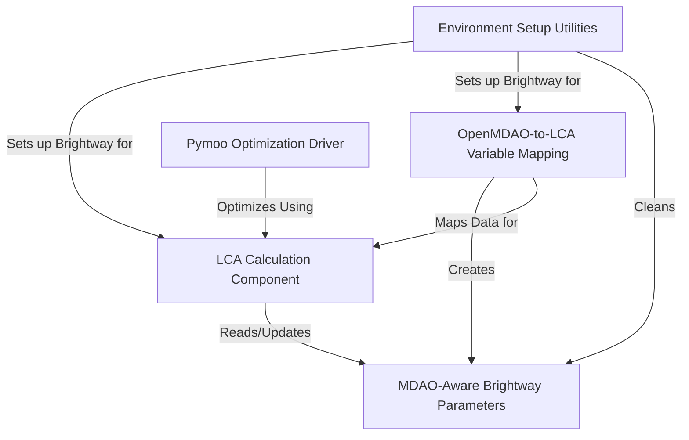
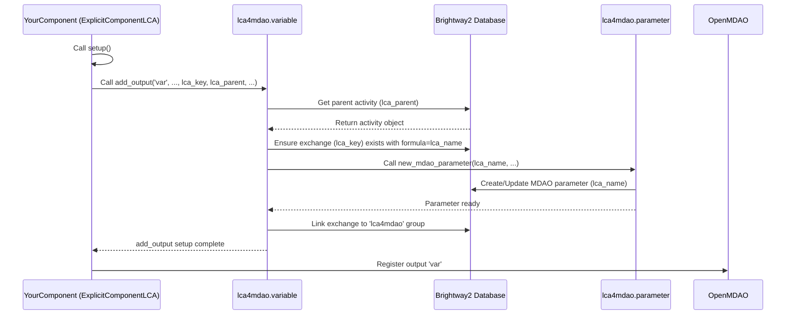

# Tutorial: LCA4MDAO

`LCA4MDAO` is a project that helps engineers design better products by considering their *environmental impact* alongside traditional engineering goals. It connects the **OpenMDAO** framework, used for complex system optimization, with the **Brightway2** software, used for calculating a product's environmental footprint (like carbon emissions). This allows you to optimize your design to be **lighter**, **cheaper**, *and* more *environmentally friendly* at the same time.


## Visual Overview



## Chapters

1. [Environment Setup Utilities
](01_environment_setup_utilities_.md)
2. [OpenMDAO-to-LCA Variable Mapping
](02_openmdao_to_lca_variable_mapping_.md)
3. [MDAO-Aware Brightway Parameters
](03_mdao_aware_brightway_parameters_.md)
4. [LCA Calculation Component
](04_lca_calculation_component_.md)
5. [Pymoo Optimization Driver
](05_pymoo_optimization_driver_.md)

---

# Chapter 2: OpenMDAO-to-LCA Variable Mapping

Welcome back to the `LCA4MDAO` tutorial! In the [previous chapter](01_environment_setup_utilities_.md), we set up our essential environment by initializing Brightway2 and importing LCA databases. Now that our LCA environment is ready, the crucial next step is to connect the design and performance variables calculated *within* your OpenMDAO model to the inputs required for the Life Cycle Assessment.

Think about it: your OpenMDAO model determines things like the weight of a component, the amount of fuel consumed, or the electrical energy used. To perform an LCA, you need to know *these specific amounts* for the design currently being evaluated. How does `LCA4MDAO` bridge this gap, taking a number from an OpenMDAO calculation and feeding it into a Brightway2 LCA activity?

This is where **OpenMDAO-to-LCA Variable Mapping** comes in. It's the mechanism that automatically takes the value of an OpenMDAO output variable and makes it available as a parameter for your LCA calculations in Brightway2.

## The Problem: Bridging OpenMDAO and Brightway2

Imagine you have an OpenMDAO component that calculates the structural weight of an aircraft wing made primarily of aluminum. It outputs a variable, let's call it `wing_weight`, with a value in kilograms.

```python
from openmdao.api import ExplicitComponent

class WingWeightComp(ExplicitComponent):
    def setup(self):
        # ... inputs for wing design parameters ...
        self.add_output('wing_weight', units='kg', val=1000.0)
        # ... declare partials ...

    def compute(self, inputs, outputs):
        # ... calculation of outputs['wing_weight'] ...
        pass
```

Meanwhile, in your Brightway2 LCA database, you have an activity representing "aluminum production" that takes 'kilogram' as an input amount to model its environmental impact.

The challenge is: how do you dynamically tell Brightway2 to use the current `wing_weight` value from your OpenMDAO model as the amount of 'aluminum production' input for your LCA calculation?

Manually updating Brightway2 every time OpenMDAO changes a variable during an optimization run would be impossible. We need an automated, integrated system.

## The Solution: `ExplicitComponentLCA`

`LCA4MDAO` solves this with a specialized OpenMDAO component type: `ExplicitComponentLCA`. This component is a standard OpenMDAO `ExplicitComponent` but with added capabilities to automatically handle the LCA mapping.

The key difference is in how you define outputs. When you declare an output variable using `self.add_output` in an `ExplicitComponentLCA`, you can include extra arguments (`lca_key`, `lca_parent`, etc.) that provide the mapping information to Brightway2.

Let's see how our `WingWeightComp` example would look using `ExplicitComponentLCA`:

```python
from lca4mdao.variable import ExplicitComponentLCA
import brightway2 as bw # Needed to get the LCA activity key

# Define the key for the aluminum activity in your database
# This assumes 'ecoinvent 3.8 cutoff' is your database name
# and you know the specific key for aluminum production
# You'd get this key by searching your Brightway2 database
aluminum_production_key = ('ecoinvent 3.8 cutoff', 'some_aluminum_activity_code')

# Define the key for the parent activity that will 'consume' the aluminum
# Let's assume you created a custom activity for your aircraft assembly
aircraft_assembly_key = ('aircraft', 'hybrid_aircraft') # From example code

class WingWeightCompLCA(ExplicitComponentLCA):
    def setup(self):
        # ... inputs for wing design parameters ...

        # Now, declare the output with LCA mapping information
        self.add_output(
            'wing_weight',
            units='kg',
            val=1000.0,
            lca_key=aluminum_production_key, # What LCA activity does this variable map to?
            lca_parent=aircraft_assembly_key, # Which LCA activity uses this input?
            lca_units='kilogram',           # What unit should Brightway2 use?
            lca_name='wing_aluminum_input', # A name for this specific LCA input (can be same as output name)
            exchange_type='technosphere'    # Is it a production input ('technosphere') or emission ('biosphere')?
        )
        # ... declare partials ...

    def compute(self, inputs, outputs):
        # ... calculation of outputs['wing_weight'] ...
        # For the example, let's just set a dummy value
        outputs['wing_weight'] = 1500.0 # Example calculated weight
```

**Explanation:**

1.  **`from lca4mdao.variable import ExplicitComponentLCA`**: We import the specialized component class.
2.  **Inherit from `ExplicitComponentLCA`**: Your component class now inherits from `ExplicitComponentLCA` instead of the standard `ExplicitComponent`.
3.  **`lca_key`**: This tells `LCA4MDAO` *which* specific activity from your LCA database (like Ecoinvent) corresponds to this output variable. You provide the Brightway2 key (usually a tuple like `('database_name', 'activity_code')`).
4.  **`lca_parent`**: This is the key of the Brightway2 activity that *uses* or *consumes* the material/energy represented by this variable. In our example, the 'aircraft assembly' activity uses the 'aluminum production' activity.
5.  **`lca_units`**: The units required by the LCA activity in Brightway2. `LCA4MDAO` handles unit conversion if your OpenMDAO `units` are different, but specifying the correct LCA unit here is crucial.
6.  **`lca_name`**: A unique name for this specific input *within* the `lca_parent` activity in Brightway2. This name is used to create a special Brightway2 parameter.
7.  **`exchange_type`**: Specifies if this is a standard input/output in the economic/industrial system (`'technosphere'`) or an emission/resource flow to/from the environment (`'biosphere'`). Aluminum production is a technosphere activity input. If you were mapping CO2 emissions, it would be `'biosphere'`.

When OpenMDAO's `prob.setup()` is called, the `ExplicitComponentLCA` component registers its LCA-mapped outputs. `LCA4MDAO` intercepts this and does some magic (explained below) to set up the connection in Brightway2. Then, during `prob.run_driver()` or `prob.run_model()`, whenever the `compute` method of this component is executed and updates the `wing_weight` output, `LCA4MDAO` automatically pushes this new value into the corresponding Brightway2 parameter.

## How it Works (The Magic Behind `add_output`)

Let's look at the `add_output` method within `ExplicitComponentLCA` (in `lca4mdao/variable.py`) and trace what happens when those `lca_` arguments are provided.

```python
# Simplified view of lca4mdao/variable.py
class ExplicitComponentLCA(ExplicitComponent):
    # ... other methods ...

    def add_output(self, name, val=1.0, ..., lca_key=None, lca_name=None,
                   lca_units=None, lca_parent=("mdao", "functional_unit"),
                   exchange_type="technosphere", ...):

        if lca_key is not None: # <-- This block is the LCA mapping part
            # 1. Basic checks (e.g., ensure val is scalar)
            if not np.isscalar(val):
                 # ... raise error ...

            # 2. Set default names/units if not provided
            if lca_name is None:
                lca_name = name
            if lca_units is None:
                # ... logic to guess units ...
                lca_units = 'unit' if units is None else units

            # 3. Add/Update the exchange in the parent LCA activity
            activity = bw.get_activity(lca_parent)
            # Remove any existing exchange to the same lca_key
            for exc in activity.exchanges():
                 if exc.input == lca_key:
                     exc.delete()
            # Add the new exchange, using the lca_name as the formula
            activity.new_exchange(input=lca_key, amount=val, formula=lca_name, type=exchange_type).save()

            # 4. Create/Update a special MDAO parameter in Brightway2
            from .parameter import parameters # Access the parameter manager
            parameters.new_mdao_parameter(lca_name, val, name, lca_units)

            # 5. Link the exchange to the lca4mdao parameter group
            parameters.add_exchanges_to_group("lca4mdao", activity)

        # Call the original OpenMDAO add_output to register the variable
        return super().add_output(name, val=val, ...)
```

**Step-by-step Walkthrough (During `prob.setup()`):**

1.  When `prob.setup()` is called, OpenMDAO processes each component and its `setup` method.
2.  When your `ExplicitComponentLCA` component's `setup` runs, it calls `self.add_output(...)` for each output.
3.  For outputs with `lca_key` provided, the `if lca_key is not None:` block inside `ExplicitComponentLCA.add_output` is executed.
4.  It retrieves the target "parent" LCA activity (`lca_parent`) from Brightway2.
5.  It ensures that an *exchange* exists within this parent activity linking it to the `lca_key` activity (e.g., the 'aircraft assembly' activity having an input exchange from 'aluminum production'). Crucially, it sets the *amount* of this exchange to a *formula* which is just the `lca_name` you provided (e.g., `formula='wing_aluminum_input'`). This means the amount is now controlled by a parameter named 'wing\_aluminum\_input'.
6.  It then calls `parameters.new_mdao_parameter(lca_name, val, name, lca_units)`. This utility function, part of `lca4mdao`'s parameter management (which we'll cover in [Chapter 3: MDAO-Aware Brightway Parameters](03_mdao_aware_brightway_parameters_.md)), creates or updates a special parameter named `lca_name` (e.g., 'wing\_aluminum\_input') in Brightway2, stores its initial value (`val`), and links it back to the OpenMDAO output variable's name (`name`) and units.
7.  Finally, it associates this exchange with the `lca4mdao` parameter group in Brightway2, marking it as parameterized by `lca4mdao`.
8.  The original `OpenMDAO.ExplicitComponent.add_output` is called to complete the standard OpenMDAO variable registration.

**What happens during `prob.run_driver()`:**

*   As the OpenMDAO solver runs, it updates the output values of your components.
*   Whenever the `compute` method of your `ExplicitComponentLCA` runs and changes an LCA-mapped output (like `wing_weight`), `LCA4MDAO` has a listener or mechanism that detects this change.
*   This mechanism automatically pushes the *new* value of the OpenMDAO output (`wing_weight`) into the corresponding Brightway2 MDAO parameter ('wing\_aluminum\_input').
*   (As you'll see in [Chapter 4: LCA Calculation Component](04_lca_calculation_component_.md)), the `LcaCalculationComponent` triggers a recalculation of Brightway2 parameters *before* performing the LCA calculation, ensuring the latest MDAO values are used.

Here's a simple sequence diagram for the `setup` part of the mapping:



This mapping means that your OpenMDAO components can calculate whatever they need to, and as long as you declare the outputs using `ExplicitComponentLCA` with the correct `lca_` arguments, `LCA4MDAO` takes care of synchronizing those values with the necessary inputs in your Brightway2 LCA model.

## Example from the Code

Let's look at a simplified example from the provided `hybrid_aircraft.py` code, specifically the `Environment` component. This component gathers outputs from various parts of the aircraft model (like battery weight, structure weight, fuel used) and maps them to corresponding LCA inputs.

```python
# Simplified Environment component from hybrid_aircraft.py
from lca4mdao.variable import ExplicitComponentLCA
import brightway2 as bw # Needed for the LCA keys

# Assume these keys are defined earlier and correspond to specific
# activities in your Brightway2 database (e.g., Ecoinvent)
battery_key = ('ecoinvent 3.8 cutoff', 'battery_activity_code')
aluminium_key = ('ecoinvent 3.8 cutoff', 'aluminum_activity_code')
kerosene_key = ('ecoinvent 3.8 cutoff', 'kerosene_activity_code')
CO2_key = ('biosphere3', 'CO2_flow_code') # CO2 is a biosphere flow

# Assume these custom activities are built in Brightway2 (see build_data() in example)
aircraft_assembly_key = ("aircraft", "hybrid_aircraft")
aircraft_flight_key = ("aircraft", "hybrid_flight")


class Environment(ExplicitComponentLCA):
    def setup(self):
        # Inputs come from other OpenMDAO components
        self.add_input('battery_weight', units='kg')
        self.add_input('structure_weight', units='kg')
        self.add_input('kerosene', units='kg') # This is *per flight* fuel burn

        # Map component inputs/calculated values to LCA outputs
        self.add_output(
            'battery',         # OpenMDAO output name (can be anything)
            units='kg',        # OpenMDAO units
            val=0.,
            lca_parent=aircraft_assembly_key, # Parent activity (assembly)
            lca_units='kilogram',             # LCA unit required
            lca_key=battery_key,              # Battery production activity
            lca_name='battery_production_input' # Name of the parameter/exchange in LCA
        )
        self.add_output(
            'aluminium',
            units='kg',
            val=0.,
            lca_parent=aircraft_assembly_key, # Parent activity (assembly)
            lca_units='kilogram',
            lca_key=aluminium_key,            # Aluminium production activity
            lca_name='structure_aluminium_input'
        )
        self.add_output(
            'amount_kerosene', # OpenMDAO output name
            units='kg',
            val=0.,
            lca_parent=aircraft_flight_key,  # Parent activity (flight)
            lca_units='kilogram',
            lca_key=kerosene_key,            # Kerosene production activity
            lca_name="kerosene_consumption_input" # Name of the parameter/exchange
        )
        self.add_output(
            'CO2',
            units='kg',
            val=0.,
            lca_parent=aircraft_flight_key,  # Parent activity (flight)
            lca_units='kilogram', # Units for CO2 flow
            lca_key=CO2_key,                 # CO2 emission flow (biosphere)
            lca_name="CO2_emission",
            exchange_type='biosphere'        # Indicate it's a biosphere flow
        )

        self.declare_partials('*', '*', method='fd')

    def compute(self, inputs, outputs):
        # This is where the OpenMDAO calculation happens.
        # The values of the inputs (calculated by other components)
        # are assigned to the outputs that are mapped to LCA.

        outputs['battery'] = inputs['battery_weight']
        outputs['aluminium'] = inputs['structure_weight']
        # Note: the example multiplies kerosene by cycles here for total impact
        outputs['amount_kerosene'] = inputs['kerosene'] # Assuming inputs['kerosene'] is total for all cycles
        # Note: the example calculates CO2 based on kerosene here
        outputs['CO2'] = inputs['kerosene'] * 3.15 # Simplified: 3.15 kg CO2 per kg kerosene
```

**Mapping Details Table:**

| OpenMDAO Variable Name (`name`) | OpenMDAO Units (`units`) | LCA Parameter Name (`lca_name`) | LCA Unit (`lca_units`) | LCA Source (`lca_key`)           | LCA Parent (`lca_parent`) | Exchange Type (`exchange_type`) |
| :------------------------------ | :----------------------- | :------------------------------ | :--------------------- | :------------------------------- | :------------------------ | :------------------------------ |
| `battery`                       | `kg`                     | `battery_production_input`      | `kilogram`             | `battery_key` (ecoinvent)        | `aircraft_assembly_key`   | `technosphere`                  |
| `aluminium`                     | `kg`                     | `structure_aluminium_input`     | `kilogram`             | `aluminium_key` (ecoinvent)      | `aircraft_assembly_key`   | `technosphere`                  |
| `amount_kerosene`               | `kg`                     | `kerosene_consumption_input`    | `kilogram`             | `kerosene_key` (ecoinvent)       | `aircraft_flight_key`     | `technosphere`                  |
| `CO2`                           | `kg`                     | `CO2_emission`                  | `kilogram`             | `CO2_key` (biosphere3)           | `aircraft_flight_key`     | `biosphere`                     |

This component serves as a central point where various MDAO outputs are collected and explicitly linked to their corresponding inputs or emissions in the LCA model. By using `ExplicitComponentLCA` and these specific `add_output` parameters, `LCA4MDAO` knows which OpenMDAO variable corresponds to which Brightway2 parameter and exchange, automating the data transfer.

## Conclusion

In this chapter, we explored the core concept of OpenMDAO-to-LCA Variable Mapping in `LCA4MDAO`. We learned that the specialized `ExplicitComponentLCA` allows you to tag OpenMDAO output variables with specific LCA information (`lca_key`, `lca_parent`, `lca_units`, `lca_name`, `exchange_type`). This mapping automatically creates and manages parameters in Brightway2 that are linked to your OpenMDAO variables, ensuring that the latest design values are available for LCA calculations.

This mechanism provides the crucial link, automatically keeping your LCA model synchronized with the changing design during an OpenMDAO run.

Now that we understand how MDAO variables are mapped and transferred to Brightway2 as parameters, the next step is to understand these special Brightway2 parameters themselves and how they integrate with the LCA calculation process. This is the topic of the next chapter: [MDAO-Aware Brightway Parameters](03_mdao_aware_brightway_parameters_.md).

---

<sub><sup>Generated by [AI Codebase Knowledge Builder](https://github.com/The-Pocket/Tutorial-Codebase-Knowledge).</sup></sub> <sub><sup>**References**: [[1]](https://github.com/mid2SUPAERO/LCA4MDAO/blob/229090922a6d94c358244f6d01104344218a71ee/lca4mdao/examples/hybrid_aircraft.py), [[2]](https://github.com/mid2SUPAERO/LCA4MDAO/blob/229090922a6d94c358244f6d01104344218a71ee/lca4mdao/examples/sellar.py), [[3]](https://github.com/mid2SUPAERO/LCA4MDAO/blob/229090922a6d94c358244f6d01104344218a71ee/lca4mdao/examples/sellar_ecoinvent.py), [[4]](https://github.com/mid2SUPAERO/LCA4MDAO/blob/229090922a6d94c358244f6d01104344218a71ee/lca4mdao/parameter.py), [[5]](https://github.com/mid2SUPAERO/LCA4MDAO/blob/229090922a6d94c358244f6d01104344218a71ee/lca4mdao/variable.py)</sup></sub>

<sub><sup>Generated by [AI Codebase Knowledge Builder](https://github.com/The-Pocket/Tutorial-Codebase-Knowledge).</sup></sub>
